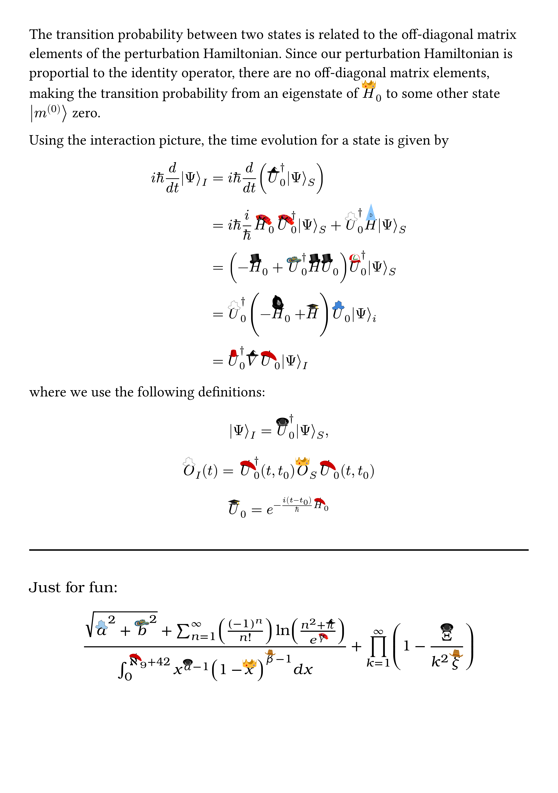

**realhats** puts real hats on symbols in math mode. Why settle for the lifeless, old-fashioned circumflex when your variables could sport berets, sombreros, top hats, and more? Inspiration and most hats from the original [realhats for LaTeX](https://github.com/mscroggs/realhats).

Before and after **realhats**:

  
  

